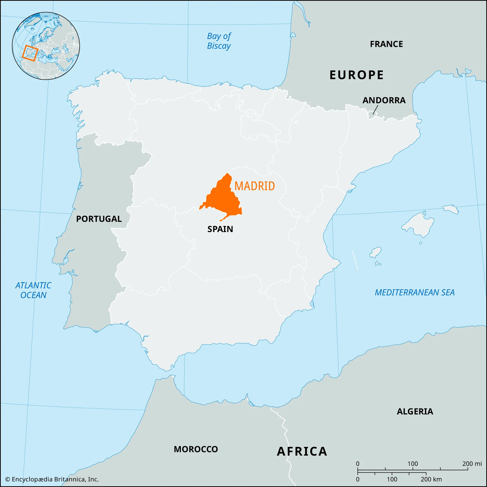
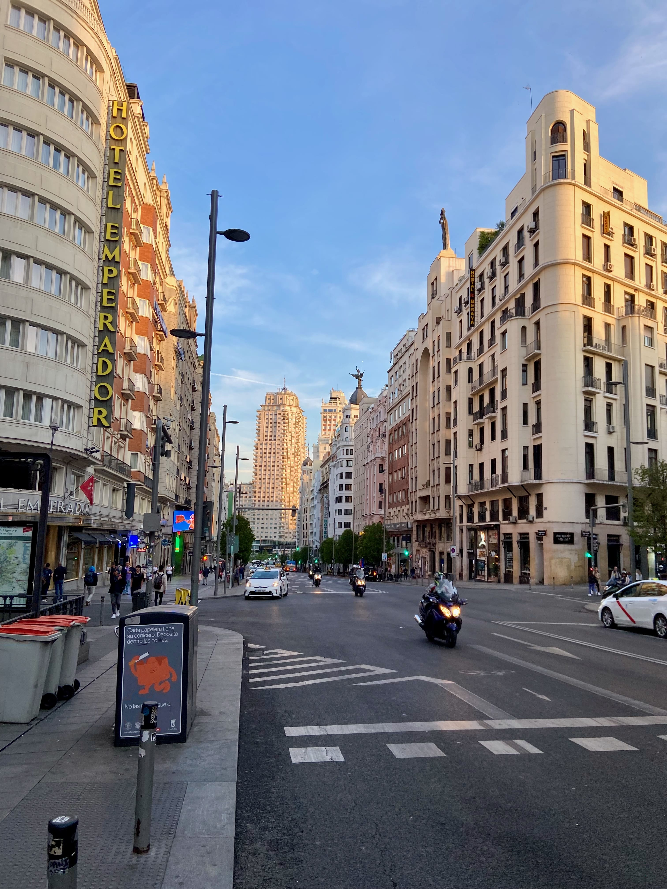
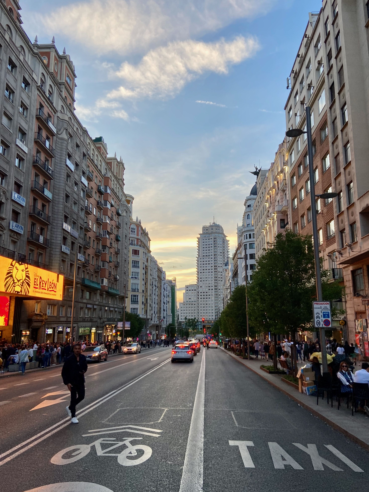
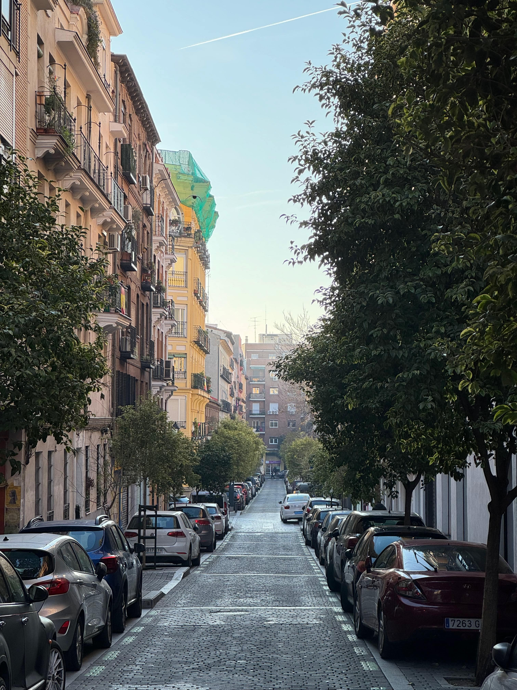
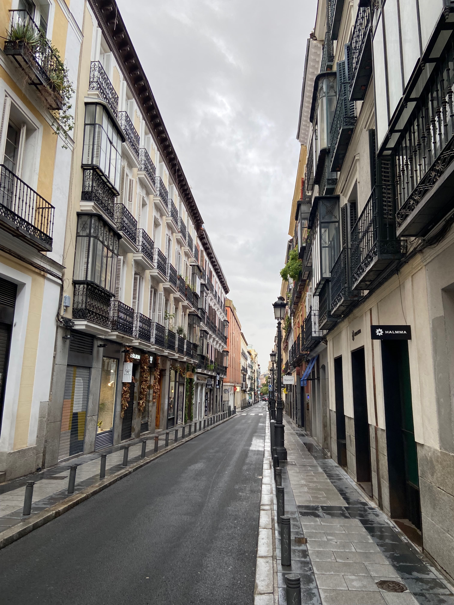

# О Мадриде

## Краткая история Мадрида
Мадрид — столица Испании, с богатой и многообразной историей. Основанный в IX веке маврами как крепость на реке Мансанарес, Мадрид прошел долгий путь от маленькой деревни до великолепной столицы. Важные исторические события, такие как коронация Карлоса I и период Испанского Золотого века, сформировали Мадрид современный.

## География и климат
Расположенный в центре Испании, на высоте 667 метров над уровнем моря, Мадрид имеет континентальный климат. Зимы здесь прохладные с небольшим количеством осадков, а летом температура может подниматься до +40°C.

## Культурное наследие
Мадрид известен своими музеями мирового класса, такими как Прадо, Рейна София и Тиссен-Борнемиса. Город также гордится своими королевскими дворцами, историческими площадями и живым театральным сообществом.

## Экономика и демография
С населением около 3,2 миллиона человек, Мадрид — один из экономических центров Европы. Город привлекает международные компании и туристов, что способствует его динамичному экономическому росту.

## Традиционная и современная культура
Мадрид идеально сочетает в себе традиции и модерн. Здесь можно насладиться фламенко, посетить традиционные тапас-бары и одновременно погрузиться в современное искусство и культурные мероприятия.

## Важные мероприятия
Ежегодно в Мадриде проходят многочисленные фестивали, спортивные соревнования и культурные события, такие как Фиеста де Сан Исидро, который привлекает тысячи посетителей.

## Советы для туристов
Планируя посещение Мадрида, учитывайте его континентальный климат и избегайте пик летней жары для комфортного пребывания. Остерегайтесь туристических ловушек, предпочитая места, популярные среди жителей города.

## Фотографии

