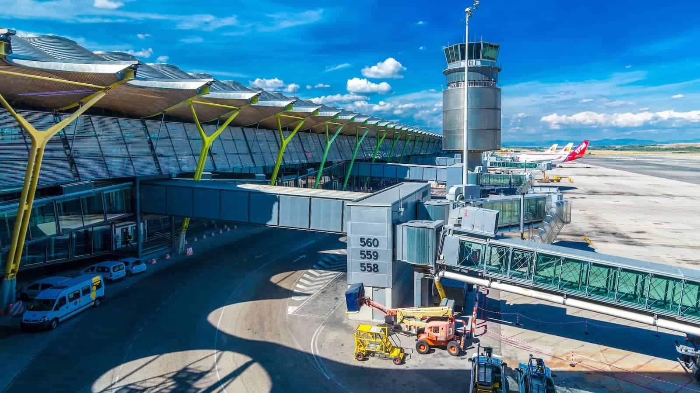
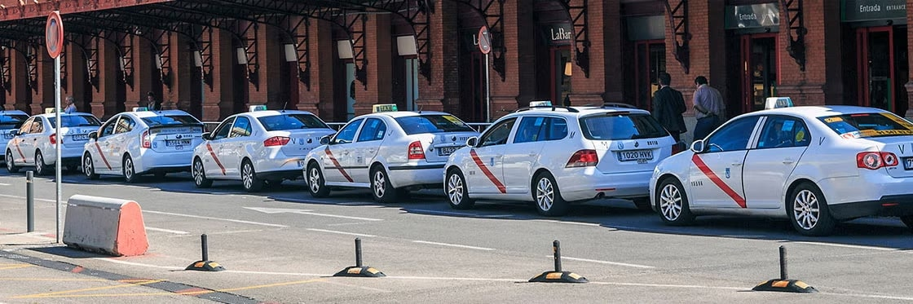

# В/из аэропорта Мадрида

Аэропорт Мадрида, известный как Madrid-Barajas (Мадрид-Барахас), является единственным аэропортом столицы Испании и одним из крупнейших аэропортов в Европе. Он расположен в 12 километрах к северо-востоку от центральной Мадрида и имеет четыре пассажирских терминала (T1, T2, T3 и T4).

## Метро
Метро – один из самых удобных способов добраться до аэропорта Madrid-Barajas и обратно. [Линия 8](https://www.metromadrid.es/es/linea/linea-8) связывает аэропорт с центральной частью города.

- **Маршруты и станции**: Основные нужные вам станции: Aeropuerto T4, Aeropuerto T1-T2-T3 (терминалы 1, 2 и 3), Nuevos Ministerios (центральная станция).
- **Цены и билеты**:
  - 0,60 евро за поездку (в зону А)
  - 3 евро Airport fee (доплата за проезд в аэропорт).
  - [транспортная карта](https://www.metromadrid.es/es/viaja-en-metro/tipos-de-tarjeta) включена в стоимость
Проезд можно оплатить наличными или картой.

## Автобус
> // Раздел в разработке

Существует несколько автобусных маршрутов, которые связывают аэропорт с различными районами Мадрида.
Например, экспресс–автобус 200 соединяет аэропорт с центральной частью города. Стоимость поездки составляет 5 евро. Возможно, только наличными.

## Такси
Такси – популярный и комфортабельный способ добраться от аэропорта до любой точки города.

### [Uber](https://www.uber.com/es/en/download/) (или другие аналогичные сервисы, такие как [Cabify](https://cabify.com/en) или FreeNow)
Легко заказывается через приложение. Стоимость поездки в центр города составляет около 20-30 евро.

### Традиционное такси
Едет по таксометру, получается чуть дороже сервисов. Стоимость поездки в центр города составляет около 30-40 евро.
Можно взять такси прямо на выходе из аэропорта. Оплата наличными или картой (в зависимости от водителя).

