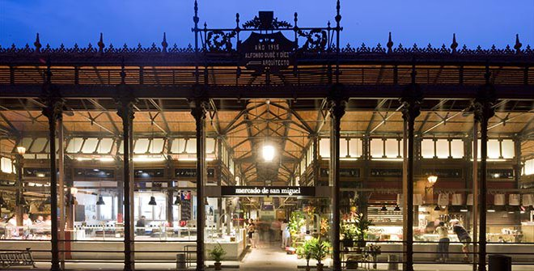
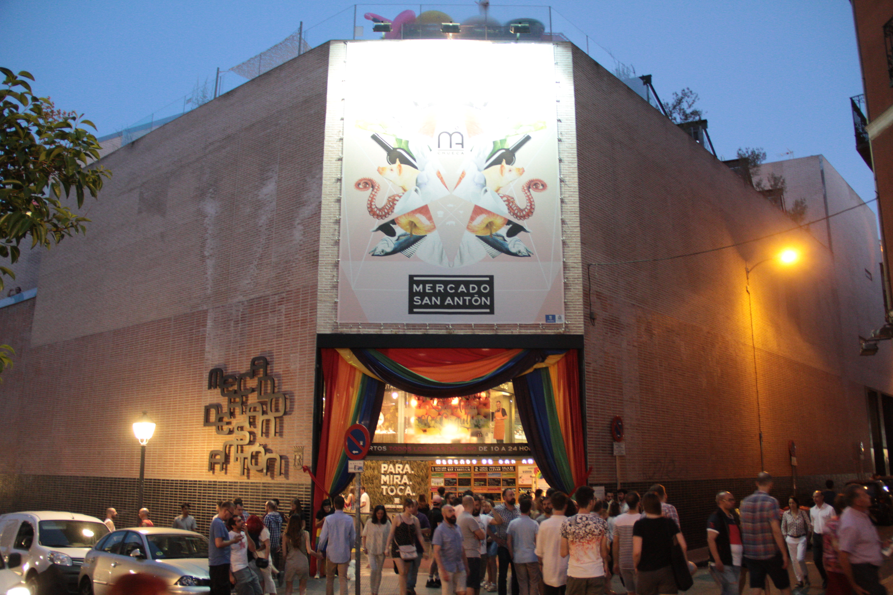
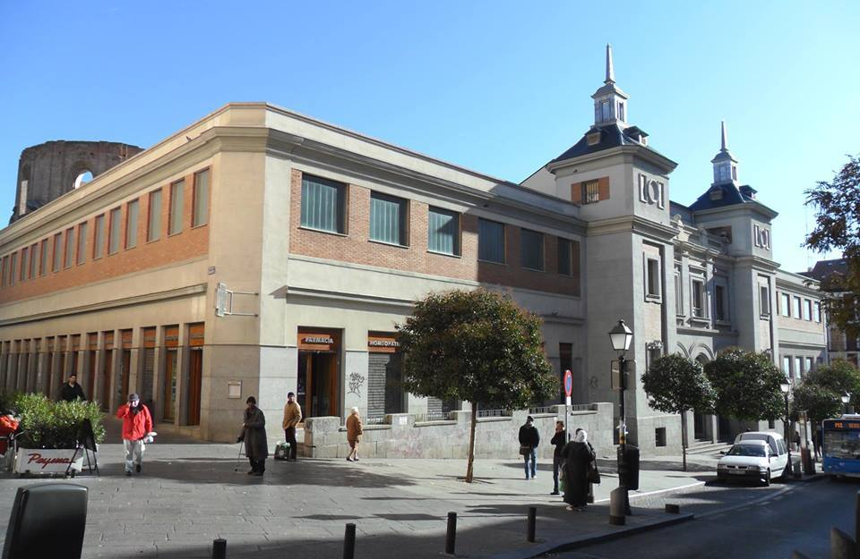
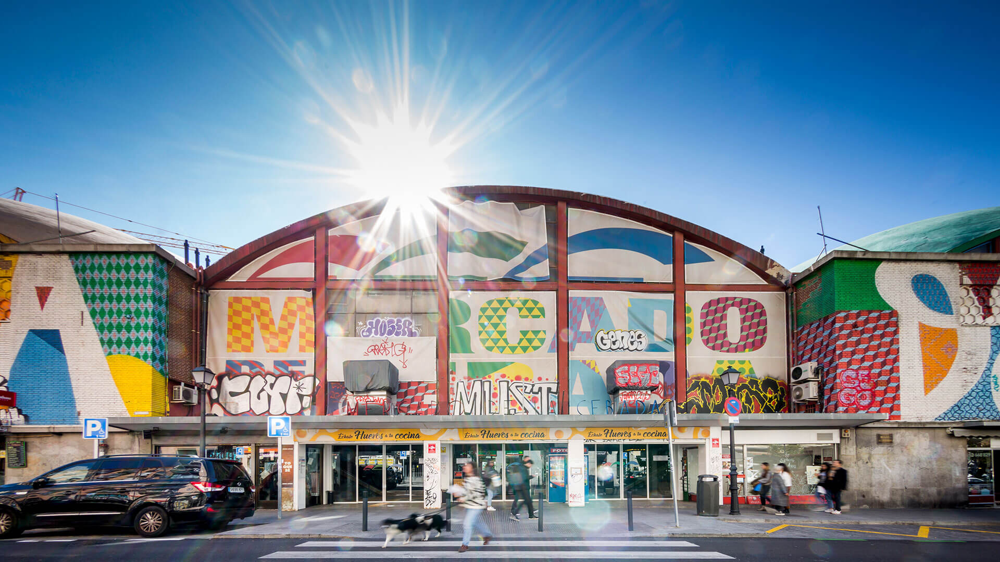
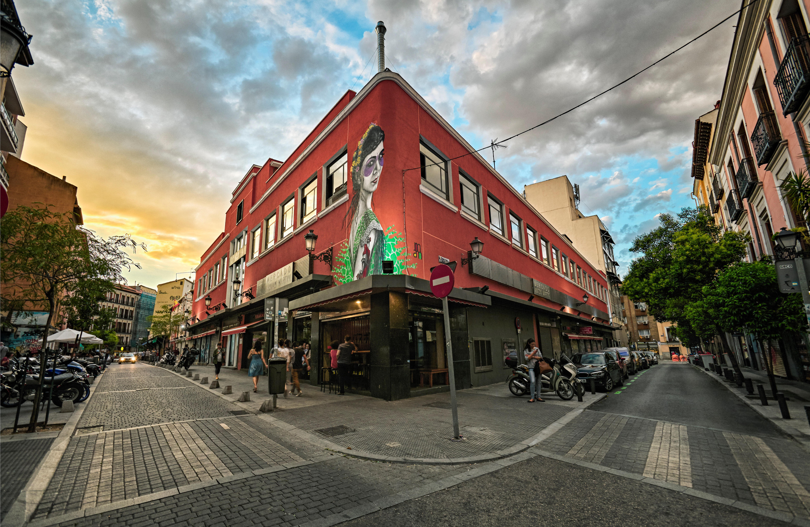

# Рынки Мадрида

Мадрид известен своими яркими и разнообразными рынками, которые предлагают всё от свежих продуктов до антиквариата и ремесленных изделий. Вот пять известных мадридских рынков, которые стоит посетить.

## [Mercado de San Miguel](https://maps.app.goo.gl/PseLS2omnfjj92Bg7)

Один из самых известных гастрономических рынков в Мадриде, расположенный недалеко от Пласа Майор. Этот красивый железный и стеклянный рынок предлагает широкий ассортимент высококачественных продуктов, от свежих морепродуктов до изысканных сыров и вин.

## [Mercado de San Antón](https://maps.app.goo.gl/rRMFGneNzfc8Xtu76)

Расположен в районе Чуэка, этот современный рынок славится своими кулинарными стендами и барами на верхнем этаже, где можно попробовать разнообразные блюда. На первых двух этажах продаются свежие продукты и деликатесы.

## [Mercado de San Fernando](https://maps.app.goo.gl/NmhzN12zLBjHgsSQ8)

Находится в районе Лавапьес, этот рынок меньше и менее туристический, чем другие. Он предлагает широкий выбор местных продуктов и органических товаров, а также места, где можно недорого поесть.

## [Mercado de la Cebada](https://maps.app.goo.gl/BxK2fnonm4a7KiUi6)

Этот большой и традиционный рынок расположен в Ла Латина. Он известен своими свежими продуктами, мясом и рыбой. Здесь также проводятся различные культурные мероприятия и праздники.

## [Mercado de Antón Martín](https://maps.app.goo.gl/UAReqCQSbPd1wAeu8)

Ситуированный в центре Мадрида, этот рынок предлагает традиционные испанские продукты, а также изделия местных ремесленников. Здесь можно найти всё от свежей выпечки до арт-объектов.

Посещение рынков Мадрида позволяет не только купить отличные продукты, но и погрузиться в атмосферу местной жизни, попробовать национальные блюда и узнать больше о культуре города.
