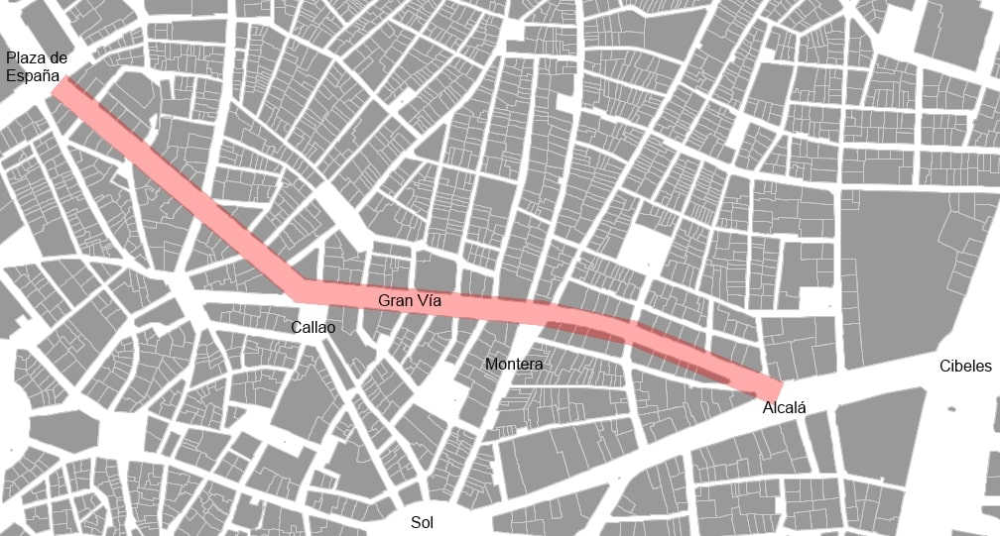
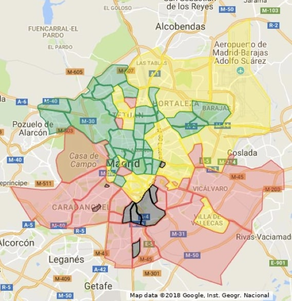

# Районы Мадрида

Мадрид можно разделить на две части: выше Gran Via и ниже.
Принято считать, что районы выше Gran Via более старые и тихие, а ниже - более молодежные и шумные.

## Выше Gran Via
Хотя Gran Via и является главной улицей Мадрида, районы выше Gran Via считаются более тихими и спокойными.
- **Malasaña** - район, где много молодежи, баров и ресторанов.
- **Chueca** - район, где много гей-баров и ресторанов.
- **Salamanca** - район, где много дорогих магазинов и ресторанов.
- **Chamberí** - район, где много старых зданий и университетов.
- **Moncloa** - район, где много студентов и университетов.

## Ниже Gran Via
Районы ниже Gran Via считаются более молодежными и шумными.
- **Lavapiés** - район, где много мигрантов и ресторанов.
- **La Latina** - район, где много туристов и ресторанов.
- **Sol** - район, где много туристов и магазинов.
- **Retiro** - район, где много парков и музеев.
- **Atocha** - район, где много вокзалов и музеев.

## Карты районов

### Чья-то карта
Однажды кто-то составил карту районов Мадрида и многие с ней согласны. Стоит отметить, что это не официальная карта, а скорее мнение одного человека. Картинка кликабельна.

### Карта количества налогов по районам
Еще одна интересная карта, которая показывает, сколько налогов платят жители разных районов Мадрида. Чем темнее цвет, тем больше налогов.
> // Добавить карту
