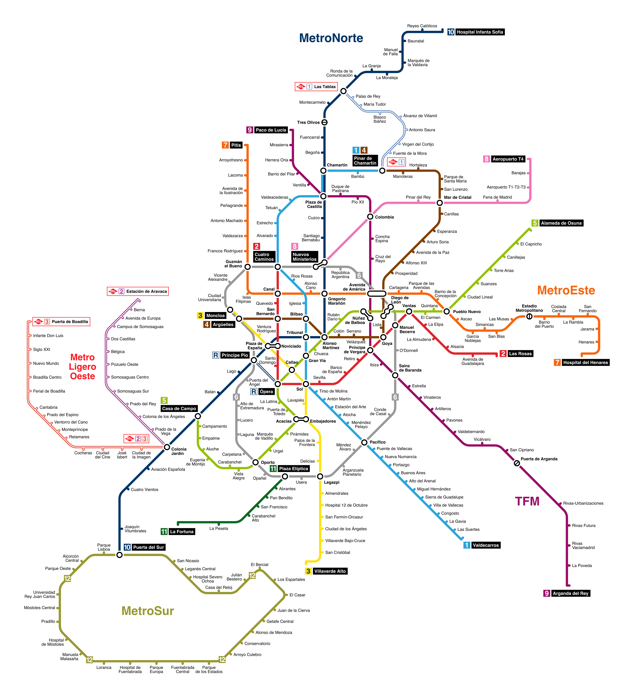

# Метро Мадрида

## Общая информация
Метрополитен Мадрида, одна из самых обширных и эффективных транспортных систем в Европе, начал свою работу в 1919 году. С тех пор сеть расширилась и сейчас включает в себя более 300 станций, обслуживая миллионы пассажиров ежедневно.

## Как пользоваться метро
### Покупка и пополнение билетов
Билеты можно приобрести в билетных автоматах на любой станции метро. Доступны как одноразовые билеты, так и проездные карты, которые могут быть пополнены.

### Тарифы
Стоимость проезда зависит от количества зон, через которые проходит маршрут.
В терминале по продаже билеты выберите конечную станцию, чтобы узнать стоимость проезда.
Стандартный билет в зоне А стоит около 1,50 евро.
Можно купить перезаряжаемую карту, которая позволяет сэкономить на проезде. При покупке 10 поездок цена за поездку составляет около 0,61 евро.

### Часы работы
Метро работает с 6:00 утра до 1:30 ночи. Время работы может быть расширено во время праздников и особых мероприятий.
На [официальном сайте метро Мадрида](https://www.metromadrid.es/es/linea/linea-1#line-timetable) можно найти информацию о интервалах движения поездов и времени работы каждой линии.

## Структура и маршруты
Мадридское метро состоит из 12 линий, каждая из которых обозначена уникальным номером и цветом, упрощающим навигацию.

## Доступность
Метро оборудовано лифтами и эскалаторами, что делает его доступным для пассажиров с ограниченными возможностями.

## Транспорт с животными
> // todo

## Велосипеды и самокаты
> // todo

В метро Мадрида запрещено провозить электросамокаты и сигвеи, о чем на входе в станцию напоминают специальные знаки.

### Приложения и ресурсы
- Пополнять карту можно через приложение Tarjeta Transporte [iOS](https://apps.apple.com/es/app/tarjeta-transporte/id1619770175) и [Android](https://play.google.com/store/apps/details?id=com.crtm.recarga&hl=es).
- Маршрут можно планировать через Google Maps, но время прибытия и интервалы движения поездов могут отличаться от реальных.
