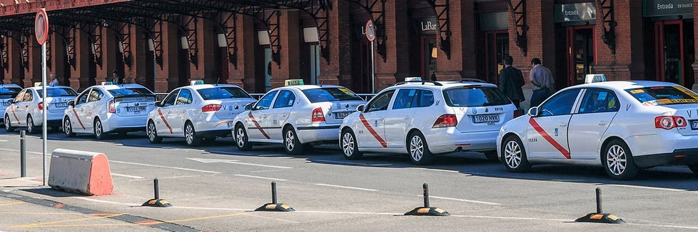

# Такси в Мадриде

## [Uber](https://www.uber.com/es/en/download/) (или другие аналогичные сервисы, такие как [Cabify](https://cabify.com/en) или FreeNow)
Самые популярные сервисы такси в Мадриде. Позволяют вызвать машину через приложение на смартфоне. 
Оплата производится через приложение, поэтому не нужно иметь наличные деньги.

## Традиционные такси
В Мадриде много такси, которые можно поймать на улице. Это белые автомобили с красной полосой на двери.
Оплата производится наличными или картой. Водители обычно не говорят по-английски, поэтому лучше иметь адрес назначения на испанском языке.

## Животные в такси
Животных можно перевозить в такси, но водители могут отказаться, если у вас нет специальной клетки или сумки для перевозки животного.

## Дети в такси
> // todo
> 
> Говорят, в официальных белых такси можно провозить детей без детского кресла, посадив их на колени. Но это не точно.
